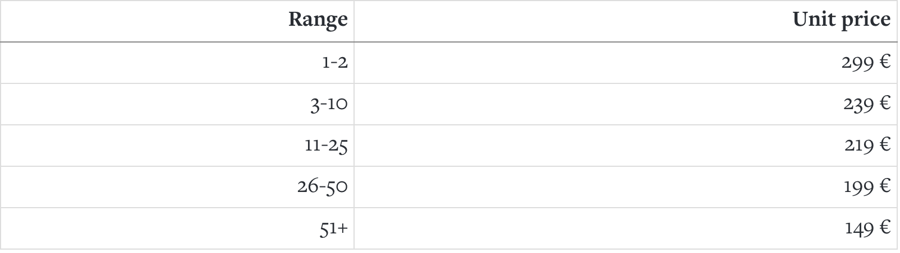

## Explanation

This is an example to test a basic feature about the pricing of a typical subscription packs, when the value of each subscription unit decreases the higher the number of subscriptions purchased, based on this table of "tiers":



**The goal is to test the class TieredPricing.php to validate the calculations of the unit prices and total prices, by testing the different "tiers" ranges.**

Tests can be found in:

```
src/tests/Unit/Checkout/Domain/TieredPricingTest.php
```


## How to start

### Requirements
- [Docker](https://www.docker.com/)

### Run Tests
Run unit tests with this command:
```sh
docker/test
```

### Test report
A test report is available on http://localhost:63342/tdd-subscription-pricing-example/src/report/html/Checkout/Domain/index.html
